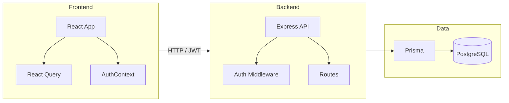

# Performance360 – Architecture overview

High-level view for humans and AI. Details live in README, AGENTS.md, and code.

## System diagram

## Layers

- **Frontend**: React + TypeScript + Tailwind. React Query for server state; AuthContext for user/session. Role-based routes (Admin, Manager, Employee).
- **Backend**: Express, middleware (auth, rate limit, logging, error handling), route modules under `/api`.
- **Data**: Prisma ORM, PostgreSQL. Schema and migrations in `backend/prisma/`.

See `AGENTS.md` (root) for commands and conventions; `.cursor/rules/` for coding rules.
